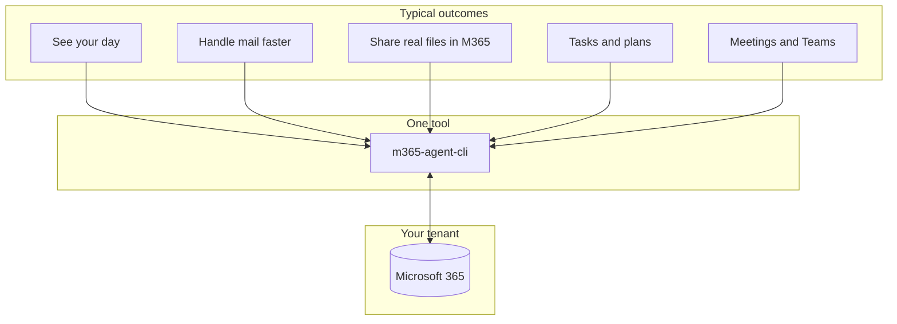

# m365-agent-cli

> Your Microsoft 365 workday from the terminal: calendar, email, files, tasks, Teams, and more—one login, scriptable, and ready for automation.

[](https://www.npmjs.com/package/m365-agent-cli)
[](./LICENSE)
[](https://github.com/markus-lassfolk/m365-agent-cli/actions/workflows/ci.yml)

**m365-agent-cli** is a command-line interface for Microsoft 365. Check your calendar, triage and send mail, work with OneDrive and SharePoint, manage Planner and To Do, post in Teams, search across workloads, and call any Microsoft Graph path you need—all from the shell. It uses **Microsoft Graph** first, with **Exchange Web Services** where still required, under a **single OAuth sign-in**.

If you use an AI assistant such as OpenClaw, pair this CLI with **[openclaw-personal-assistant](https://github.com/markus-lassfolk/openclaw-personal-assistant)** for skills and playbooks that turn these commands into delegated work.

Extended from [foeken/clippy](https://github.com/foeken/clippy).

---

## At a glance



| You want to… | What you get |
| --- | --- |
| **Start the day informed** | Today’s meetings and unread mail in one shot—great for scripts or an assistant briefing. |
| **Stay out of the browser** | Send, reply, forward, drafts, categories, and folders from the terminal. |
| **Work as a team mailbox** | Access shared calendars and inboxes when your tenant allows (`--mailbox` plus the right Graph scopes). |
| **Keep files in one place** | Search OneDrive, create share links, and hand off Office documents without mailing copies. |
| **Go beyond built-ins** | JSON output, read-only safety mode, and `graph invoke` / `graph batch` for any API path. |

---

## Who it is for

- **Terminal-first people** who want Outlook-class outcomes without living in web apps.
- **Scripters** automating stand-ups, digests, or integrations (handle secrets carefully).
- **Agent builders** giving OpenClaw or other tools real, stable M365 operations via CLI.

---

## Install

**npm (simplest):**

```bash
npm install -g m365-agent-cli
m365-agent-cli update
```

`update` checks the registry and reinstalls the latest global package.

**From source** (Bun matches CI; use `npm run start` if you prefer npm scripts):

```bash
git clone https://github.com/markus-lassfolk/m365-agent-cli.git
cd m365-agent-cli
bun install
bun run src/cli.ts -- --help
```

Pre-release versions on `main` may use a beta semver in `package.json`; npm tags and publishing are described in [docs/RELEASE.md](docs/RELEASE.md).

---

## Sign in once

1. Create an Entra (Azure AD) app registration, or run the scripted setup in [docs/ENTRA_SETUP.md](docs/ENTRA_SETUP.md).
2. Run **`m365-agent-cli login`** (device code flow). Tokens are stored under `~/.config/m365-agent-cli/`.

```bash
m365-agent-cli login
m365-agent-cli whoami
m365-agent-cli calendar today
```

Deeper topics: [docs/AUTHENTICATION.md](docs/AUTHENTICATION.md) · [docs/GRAPH_SCOPES.md](docs/GRAPH_SCOPES.md) · [docs/EWS_TO_GRAPH_MIGRATION_EPIC.md](docs/EWS_TO_GRAPH_MIGRATION_EPIC.md) (EWS retirement and migration).

Optional error reporting: set `GLITCHTIP_DSN` or `SENTRY_DSN` — [docs/GLITCHTIP.md](docs/GLITCHTIP.md).

---

## Try this next

```bash
m365-agent-cli calendar today
m365-agent-cli mail --unread -n 5
m365-agent-cli create-event "Team sync" 14:00 15:00 --day tomorrow --teams
```

Every command, flag, read-only matrix, Planner/SharePoint/Graph examples, and script ideas: **[docs/CLI_REFERENCE.md](docs/CLI_REFERENCE.md)**.

---

## Documentation

| Topic | Where |
| --- | --- |
| Full CLI reference and examples | [docs/CLI_REFERENCE.md](docs/CLI_REFERENCE.md) |
| OAuth, tokens, shared mailboxes | [docs/AUTHENTICATION.md](docs/AUTHENTICATION.md) |
| Entra app registration (scripts + portal) | [docs/ENTRA_SETUP.md](docs/ENTRA_SETUP.md) |
| Delegated Graph scopes | [docs/GRAPH_SCOPES.md](docs/GRAPH_SCOPES.md) |
| Architecture | [docs/ARCHITECTURE.md](docs/ARCHITECTURE.md) |
| Graph vs EWS coverage | [docs/GRAPH_V2_STATUS.md](docs/GRAPH_V2_STATUS.md) |
| Graph / EWS parity matrix | [docs/GRAPH_EWS_PARITY_MATRIX.md](docs/GRAPH_EWS_PARITY_MATRIX.md) |
| Maintainer goals and gaps | [docs/GOALS.md](docs/GOALS.md) |

---

## OpenClaw Personal Assistant

Playbooks and skills for using this tool as a personal assistant live in **[openclaw-personal-assistant](https://github.com/markus-lassfolk/openclaw-personal-assistant)**.

Optional: install bundled skills from this repo into OpenClaw — see [skills/README.md](skills/README.md).

---

## License

MIT
