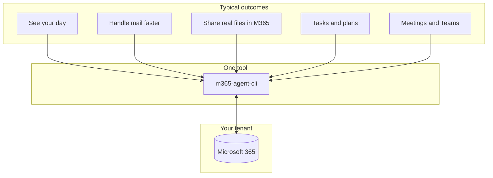

# m365-agent-cli

> Your Microsoft 365 workday from the terminal: calendar, email, files, tasks, Teams, and more—one login, scriptable, and ready for automation.

[](https://www.npmjs.com/package/m365-agent-cli)
[](./LICENSE)
[](https://github.com/markus-lassfolk/m365-agent-cli/actions/workflows/ci.yml)

**m365-agent-cli** is a command-line interface for Microsoft 365. Check your calendar, triage and send mail, work with OneDrive and SharePoint, manage Planner and To Do, post in Teams, search across workloads, and call any Microsoft Graph path you need—all from the shell. It uses **Microsoft Graph** first, with **Exchange Web Services** where still required, under a **single OAuth sign-in**.

If you use an AI assistant such as OpenClaw, pair this CLI with **[openclaw-personal-assistant](https://github.com/markus-lassfolk/openclaw-personal-assistant)** for skills and playbooks that turn these commands into delegated work.

Extended from [foeken/clippy](https://github.com/foeken/clippy).

---

## At a glance



| You want to… | What you get |
| --- | --- |
| **Start the day informed** | Today’s meetings and unread mail in one shot—great for scripts or an assistant briefing. |
| **Stay out of the browser** | Send, reply, forward, drafts, categories, and folders from the terminal. |
| **Work as a team mailbox** | Access shared calendars and inboxes when your tenant allows (`--mailbox` plus the right Graph scopes). |
| **Keep files in one place** | Search OneDrive, create share links, and hand off Office documents without mailing copies. |
| **Go beyond built-ins** | JSON output, read-only safety mode, and `graph invoke` / `graph batch` for any API path. |

---

## Supported workloads

These map to top-level `m365-agent-cli` commands (run **`m365-agent-cli --help`** for the full, grouped list and flags). Many flows use **Microsoft Graph**; some mail/calendar paths still use **EWS** depending on `M365_EXCHANGE_BACKEND`—see [docs/GRAPH_EWS_PARITY_MATRIX.md](docs/GRAPH_EWS_PARITY_MATRIX.md).

### Sign-in and CLI

- **whoami** — signed-in user / token identity
- **login** — device-code OAuth, or `--browser` for authorization-code + PKCE
- **profiles** — named identity profiles, default selection, wrong-account guardrails
- **auth** — `auth repair` diagnoses and fixes broken delegated auth
- **readiness** — machine-readable `ready`/`missingCapabilities` contract for agents
- **doctor** — non-secret diagnostic summary; `--redacted-bundle` for a shareable file
- **update** — install/update from npm
- **verify-token** — scopes and feature matrix vs your token

### Calendar and meetings

- **calendar** — list/create events (EWS or Graph)
- **graph-calendar** — Graph REST calendars, events, deltas, invitations
- **create-event**, **update-event**, **delete-event** — top-level event helpers
- **respond** — accept / tentative / decline invitations
- **forward-event** (alias `forward`) — forward an event
- **counter** (alias `propose-new-time`) — propose a new time
- **findtime** — find slots with others
- **schedule** — merged free/busy
- **suggest** — AI-assisted time suggestions
- **meeting** — standalone Teams **online meetings** (`POST /onlineMeetings`; calendar invites with Teams often use `create-event --teams`)
- **rooms** — room lists and Places

### Mail and mailbox

- **mail** — list, read, reply, forward, flags, attachments (EWS or Graph)
- **outlook-graph** — Graph mail folders and messages (REST surface alongside `mail`)
- **folders** — mail folders
- **send** — send mail
- **drafts** — drafts
- **contacts** — Outlook contacts (Graph)
- **outlook-categories** — mailbox category colors/names
- **oof** — out of office (Graph mailbox settings)
- **auto-reply** — legacy EWS inbox-rule style OOF (prefer **oof** on Graph)
- **mailbox-settings** — time zone, working hours, regional formats
- **rules** — server-side inbox rules (Graph)
- **delegates** — delegates and calendar sharing (Graph and/or EWS)

### Files and content

- **files** — OneDrive and SharePoint **drives** (list, delta, search, upload, share, permissions, versions, labels, …)
- **word**, **excel**, **powerpoint** — Office files on drives (Graph item + workbook/slide APIs mirrored from `files` where applicable)
- **onenote** — notebooks, sections, pages
- **sharepoint** (alias `sp`) — sites, lists, libraries, items, permissions
- **pages** — SharePoint **site pages**

### Teams and work

- **teams** — teams, channels, chats, messages, apps, tabs, …
- **planner** — Planner plans and tasks
- **todo** — Microsoft To Do
- **groups** — Microsoft 365 unified groups (conversations, posts)
- **bookings** — Bookings businesses, appointments, staff, services
- **approvals** — Teams / Power Automate approvals (Graph **beta**)

### People and organization

- **find** — people, groups, rooms (directory + Places)
- **people** — Graph People relevance
- **org** — profile, manager, reports
- **presence** — presence read/write and status message
- **insights** — MyAnalytics-style insights documents (delegated)

### Copilot and Viva

- **copilot** — Graph Copilot APIs (licensing and preview terms apply)
- **viva** — Viva / employee experience (**beta** Graph)

### Automation and advanced Microsoft Graph

- **graph** — raw `graph invoke` and JSON **$batch**
- **graph-search** — Microsoft Search (`POST /search/query`)
- **subscribe** / **subscriptions** / **serve** — change notifications and local webhook receiver

For every flag, JSON shape, and scripting notes, use **[docs/CLI_REFERENCE.md](docs/CLI_REFERENCE.md)** and **[docs/GRAPH_SCOPES.md](docs/GRAPH_SCOPES.md)**.

---

## Who it is for

- **Terminal-first people** who want Outlook-class outcomes without living in web apps.
- **Scripters** automating stand-ups, digests, or integrations (handle secrets carefully).
- **Agent builders** giving OpenClaw or other tools real, stable M365 operations via CLI.

---

## Install

**npm (simplest):**

```bash
npm install -g m365-agent-cli
m365-agent-cli update
```

`update` checks the registry and reinstalls the latest global package.

**From source** (Bun matches CI; use `npm run start` if you prefer npm scripts):

```bash
git clone https://github.com/markus-lassfolk/m365-agent-cli.git
cd m365-agent-cli
bun install
bun run src/cli.ts -- --help
```

Stable releases are versioned in `package.json` and published to npm when a maintainer pushes a matching Git tag — see [CHANGELOG.md](CHANGELOG.md) and [docs/RELEASE.md](docs/RELEASE.md).

**Node without Bun:** the published `bin` entry is a TypeScript file with a Bun shebang. If `m365-agent-cli` is not executable on your system, run the CLI via **tsx**, for example `npx tsx node_modules/m365-agent-cli/src/cli.ts -- --help` (for a global install, replace `node_modules/m365-agent-cli` with `$(npm root -g)/m365-agent-cli`).

**OpenClaw from npm:** after `npm install m365-agent-cli`, the skill ships at **`node_modules/m365-agent-cli/skills/m365-agent-cli/SKILL.md`**. Copy or symlink that folder into your OpenClaw skills directory, or set **`OPENCLAW_SKILLS_DIR`** to that skills root and reinstall so **postinstall** copies the skill (see [skills/README.md](skills/README.md)). To merge versioned notes into **`TOOLS.md`** without duplicate paragraphs, run **`npm run install-tools-md -- path/to/TOOLS.md`** from a clone or **`node node_modules/m365-agent-cli/scripts/install-tools-md.mjs path/to/TOOLS.md`** from an npm install.

---

## Sign in once

1. Create an Entra (Azure AD) app registration, or run the scripted setup in [docs/ENTRA_SETUP.md](docs/ENTRA_SETUP.md).
2. Run **`m365-agent-cli login`** (device code flow). Tokens are stored under `~/.config/m365-agent-cli/`.

```bash
m365-agent-cli login
m365-agent-cli whoami
m365-agent-cli calendar today
```

Deeper topics: [docs/AUTHENTICATION.md](docs/AUTHENTICATION.md) · [docs/GRAPH_SCOPES.md](docs/GRAPH_SCOPES.md) · [docs/EWS_TO_GRAPH_MIGRATION_EPIC.md](docs/EWS_TO_GRAPH_MIGRATION_EPIC.md) (EWS retirement and migration).

Optional error reporting: set `GLITCHTIP_DSN` or `SENTRY_DSN` — [docs/GLITCHTIP.md](docs/GLITCHTIP.md).

---

## Try this next

```bash
m365-agent-cli calendar today
m365-agent-cli mail --unread -n 5
m365-agent-cli create-event "Team sync" 14:00 15:00 --day tomorrow --teams
```

Every command, flag, read-only matrix, Planner/SharePoint/Graph examples, and script ideas: **[docs/CLI_REFERENCE.md](docs/CLI_REFERENCE.md)**.

---

## Documentation

| Topic | Where |
| --- | --- |
| Full CLI reference and examples | [docs/CLI_REFERENCE.md](docs/CLI_REFERENCE.md) |
| Agent workflows (deltas, Teams + files, scripting) | [docs/AGENT_WORKFLOWS.md](docs/AGENT_WORKFLOWS.md) |
| `--json` / read-only inventory | [docs/CLI_SCRIPTING_APPENDIX.md](docs/CLI_SCRIPTING_APPENDIX.md) · [docs/CLI_SCRIPTING_INVENTORY.md](docs/CLI_SCRIPTING_INVENTORY.md) |
| Optional MCP stdio server (Cursor, etc.) | [packages/m365-agent-cli-mcp/README.md](packages/m365-agent-cli-mcp/README.md) |
| OAuth, tokens, shared mailboxes | [docs/AUTHENTICATION.md](docs/AUTHENTICATION.md) |
| Entra app registration (scripts + portal) | [docs/ENTRA_SETUP.md](docs/ENTRA_SETUP.md) |
| Delegated Graph scopes | [docs/GRAPH_SCOPES.md](docs/GRAPH_SCOPES.md) |
| Assistants: `--mailbox` vs `--user`, Teams, org | [docs/PERSONAL_ASSISTANT_DELEGATION.md](docs/PERSONAL_ASSISTANT_DELEGATION.md) |
| Architecture | [docs/ARCHITECTURE.md](docs/ARCHITECTURE.md) |
| Graph vs EWS coverage | [docs/GRAPH_V2_STATUS.md](docs/GRAPH_V2_STATUS.md) |
| Graph / EWS parity matrix | [docs/GRAPH_EWS_PARITY_MATRIX.md](docs/GRAPH_EWS_PARITY_MATRIX.md) |
| Maintainer goals and gaps | [docs/GOALS.md](docs/GOALS.md) |

---

## OpenClaw Personal Assistant

Playbooks and skills for using this tool as a personal assistant live in **[openclaw-personal-assistant](https://github.com/markus-lassfolk/openclaw-personal-assistant)**.

Optional: install bundled skills from this repo into OpenClaw — see [skills/README.md](skills/README.md).

---

## License

MIT
